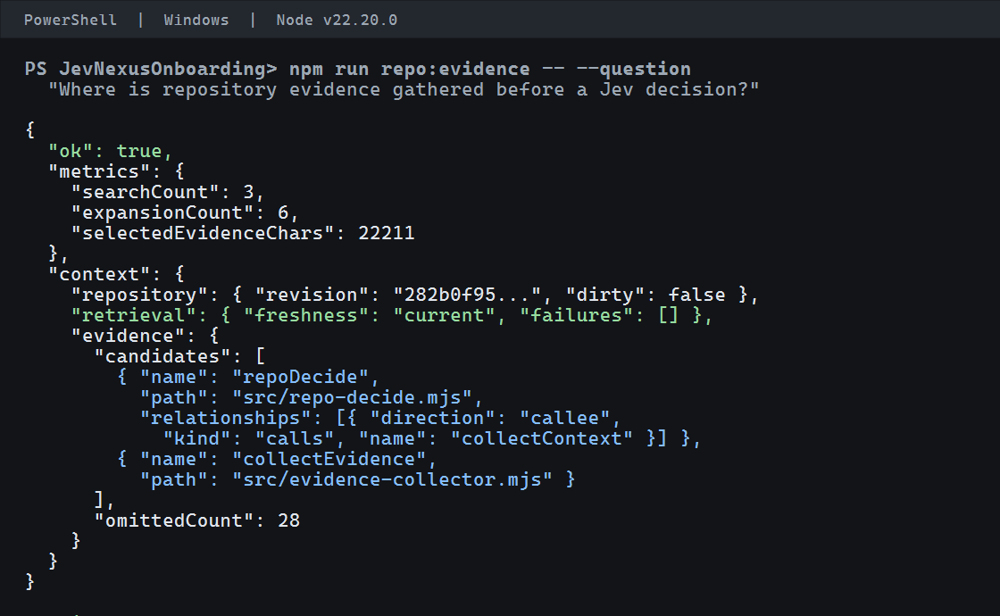

# Getting started

## Preview repository evidence

From a clean clone, install the locked dependencies and index the repository:

```powershell
git clone https://github.com/becool3000/JevNexus.git
cd JevNexus
npm ci
npm run index
npm run repo:evidence -- --question "Where is repository evidence gathered before a Jev decision?"
```

JevNexus requires Git and Node.js **22.18.0–22.x, or 24.11.0 and newer**. This range follows the installed GitNexus dependency. Use the same Node version for indexing, the command-line interface, and the MCP server.

The preview returns JSON with `ok`, collection metrics, repository freshness, candidate symbols, file locations, relationships, and omissions. It does not call Jev. Candidate ranking varies with the question and available source evidence; use the paths and excerpts to inspect the source yourself.

### Example preview

The following selected fields came from the successful Windows PowerShell walkthrough at revision `282b0f95d3220fbca8998fc5cb0049f6c1c4b2b9`, using Node.js `v22.20.0`. The bundled image is a readable rendering of these fields. Machine-local paths and unshown JSON fields are omitted.



```json
{
  "ok": true,
  "metrics": {
    "searchCount": 3,
    "expansionCount": 6,
    "selectedEvidenceChars": 22211
  },
  "context": {
    "repository": {
      "revision": "282b0f95d3220fbca8998fc5cb0049f6c1c4b2b9",
      "dirty": false
    },
    "retrieval": {
      "freshness": "current",
      "failures": []
    },
    "evidence": {
      "candidates": [
        { "name": "repoDecide", "path": "src/repo-decide.mjs" },
        { "name": "collectEvidence", "path": "src/evidence-collector.mjs" }
      ],
      "omittedCount": 28
    }
  }
}
```

## Ask Jev for a decision

Set `TYPESAFE_API_KEY` in the environment of the process that starts JevNexus. For PowerShell, set it only in the current session:

```powershell
$env:TYPESAFE_API_KEY = "your-TypeSafe-key"
npm run decide -- --question "Which symbol should I inspect first?" --decision-type choice --choices-json '["collector","reducer"]'
```

The decision requires a clean source checkout and a GitNexus index that matches its current commit. Refresh the index after source changes with `npm run index`. The decision sends the question, choices, and selected evidence to TypeSafe. Inspect a `repo_evidence` preview first when the evidence matters or may contain sensitive source.

## Connect Codex

The JevNexus installation directory contains the server code and dependencies. `JEVNEXUS_REPO_ROOT` selects the target repository, and `GITNEXUS_REPO` selects its GitNexus registration name. Keep these values pointed at the intended checkout.

Add a server entry to `~/.codex/config.toml`. Replace both example paths with your local paths:

```toml
[mcp_servers.jevnexus]
command = 'C:\Program Files\nodejs\node.exe'
args = ['C:\path\to\JevNexus\src\mcp-server.mjs']
cwd = 'C:\path\to\JevNexus'
env_vars = ["TYPESAFE_API_KEY"]
startup_timeout_sec = 60
tool_timeout_sec = 60
enabled = true
enabled_tools = ["repo_decide", "repo_evidence"]
```

For another project, keep the server path pointed at the JevNexus installation and set `cwd` plus `JEVNEXUS_REPO_ROOT` to the target checkout. Set `GITNEXUS_REPO` if that checkout is registered under a custom alias:

```toml
[mcp_servers.jevnexus]
command = 'C:\Program Files\nodejs\node.exe'
args = ['C:\path\to\JevNexus\src\mcp-server.mjs']
cwd = 'C:\path\to\YourProject'
env = { JEVNEXUS_REPO_ROOT = 'C:\path\to\YourProject', GITNEXUS_REPO = 'YourProject' }
env_vars = ["TYPESAFE_API_KEY"]
startup_timeout_sec = 60
tool_timeout_sec = 60
enabled = true
enabled_tools = ["repo_decide", "repo_evidence"]
```

Codex inherits the named API key from the environment; do not paste its value into the config file. Restart or reload the Codex session after changing MCP configuration. `repo_evidence` previews source context without a Jev call. `repo_decide` makes one bounded decision.

## Data handling

- Index creation and evidence collection run locally.
- `repo_evidence` returns selected source context to its caller but does not send it to Jev.
- `repo_decide` sends the question, choices, and selected source evidence to TypeSafe. The default response does not echo that evidence; `debug: true` includes it.
- `recordDiagnostics` is opt-in and writes ignored files under `artifacts/evidence/`. These files can contain source excerpts, questions, and results. Review them before sharing.
- `.env.example` documents variable names; the application does not automatically load a `.env` file. Set environment variables in your shell or MCP process configuration.

## Troubleshooting

| Symptom | What to check |
| --- | --- |
| Unsupported Node version or engine warnings | Run `node --version`; use Node 22.18.0–22.x or 24.11.0 and newer, then rerun `npm ci`. |
| Dependency installation fails | Confirm Git, supported Node, network access to npm, and that `package-lock.json` is present; retry with `npm ci`. |
| Preview says the repository is not indexed | Run `npm run index` from the target repository root. |
| GitNexus cannot find the repository | Check `JEVNEXUS_REPO_ROOT` and the registered alias in `GITNEXUS_REPO`; inspect `npm run repo:status`. |
| Decision reports a stale index | Confirm the target checkout is the intended one, then refresh with `npm run index`. |
| Decision refuses a dirty checkout | Commit or otherwise clear the source changes before a decision. A preview is still available and reports freshness. |
| Jev decision reports a missing key | Set `TYPESAFE_API_KEY` in the environment inherited by the CLI or Codex MCP process. `.env.example` is not loaded automatically. |
| Codex does not list the tools or MCP startup fails | Check Node version and the `command`, `args`, `cwd`, target root, and alias in MCP configuration; reload the Codex session and inspect its MCP startup log. |
| Preview evidence seems incomplete | Read the candidate paths directly, review reported omissions, and narrow the question. Treat a limited-evidence result as uncertain rather than proof that a symbol or relationship does not exist. |

For install errors, use the [installation issue form](https://github.com/becool3000/JevNexus/issues/new?template=installation.yml). For retrieval quality, use the [evidence issue form](https://github.com/becool3000/JevNexus/issues/new?template=evidence-quality.yml). Share sanitized excerpts and a bundle hash when useful; never share API keys or complete private evidence bundles.

## Further reference

- [Evidence collection, limits, and comparison record](JevNexus.md)
- [MCP and HTTP reference](Reference.md)
- [GitNexus documentation](https://github.com/abhigyanpatwari/GitNexus)
- [TypeSafe JavaScript SDK guide](https://www.typesafeai.org/guides/jev-typescript)
- [TypeSafe terms of use](https://typesafe.ai/legal/terms)
